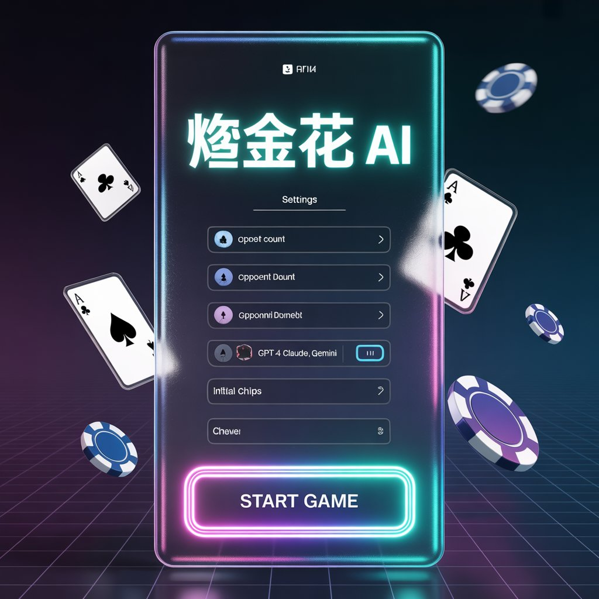
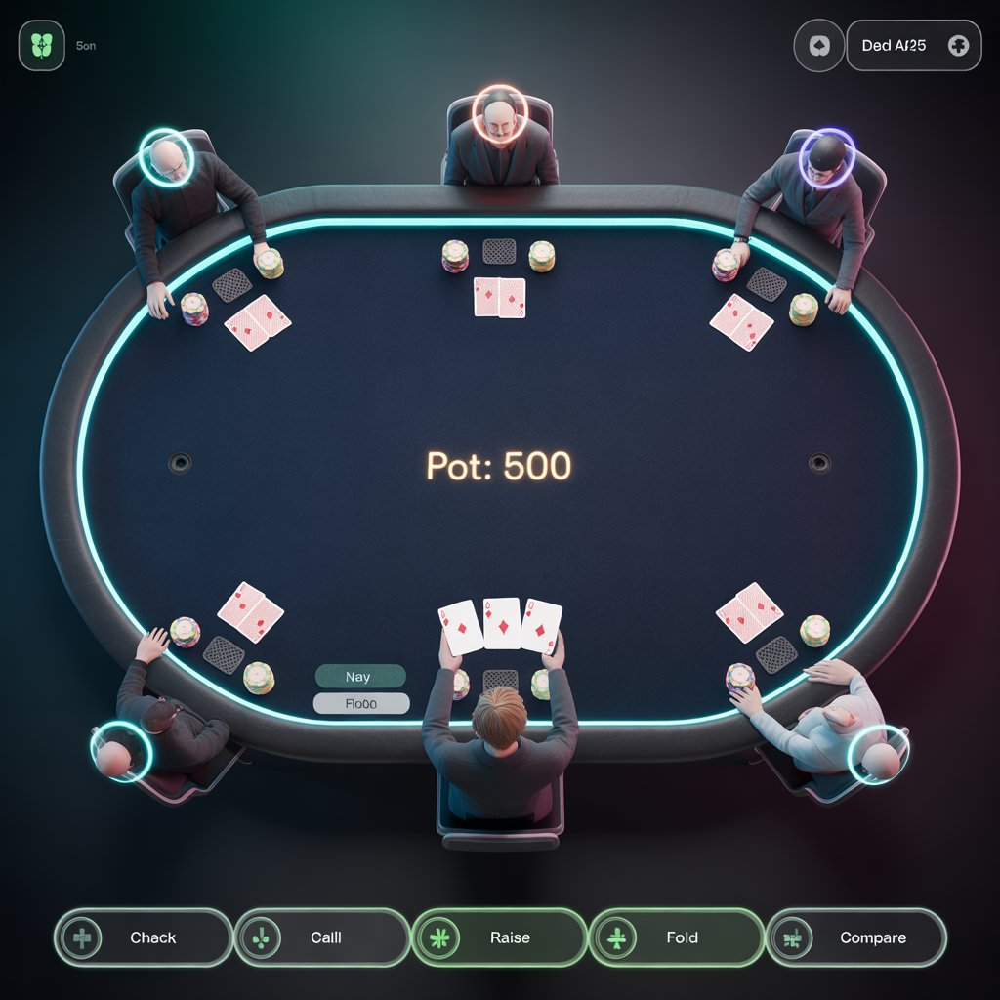
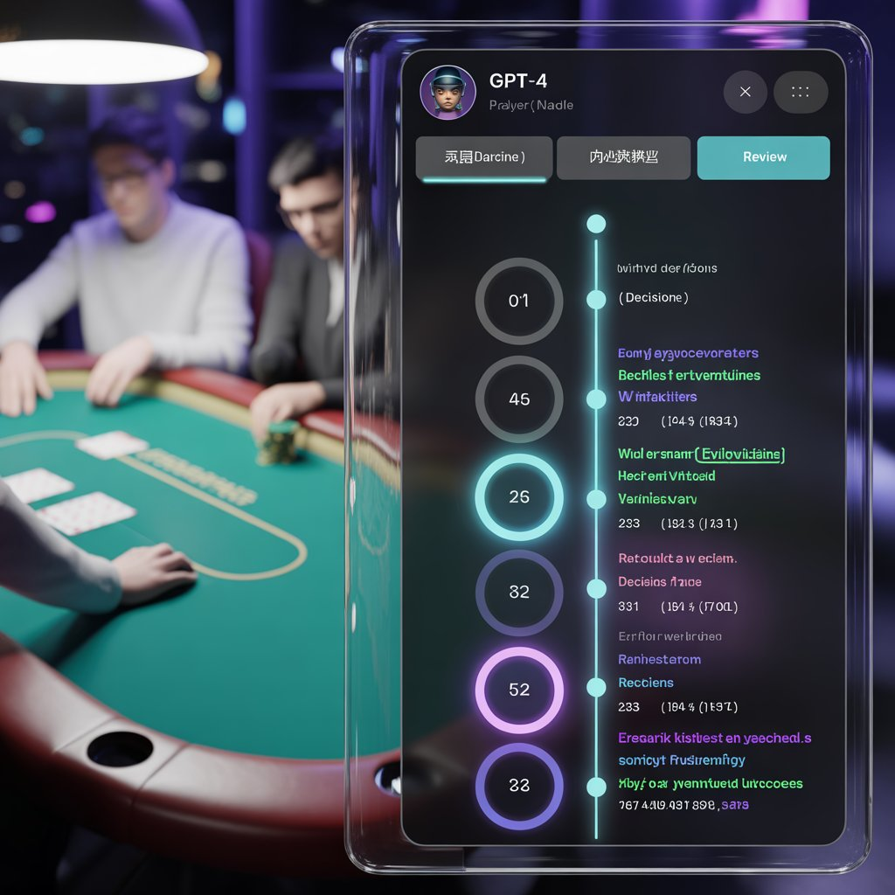
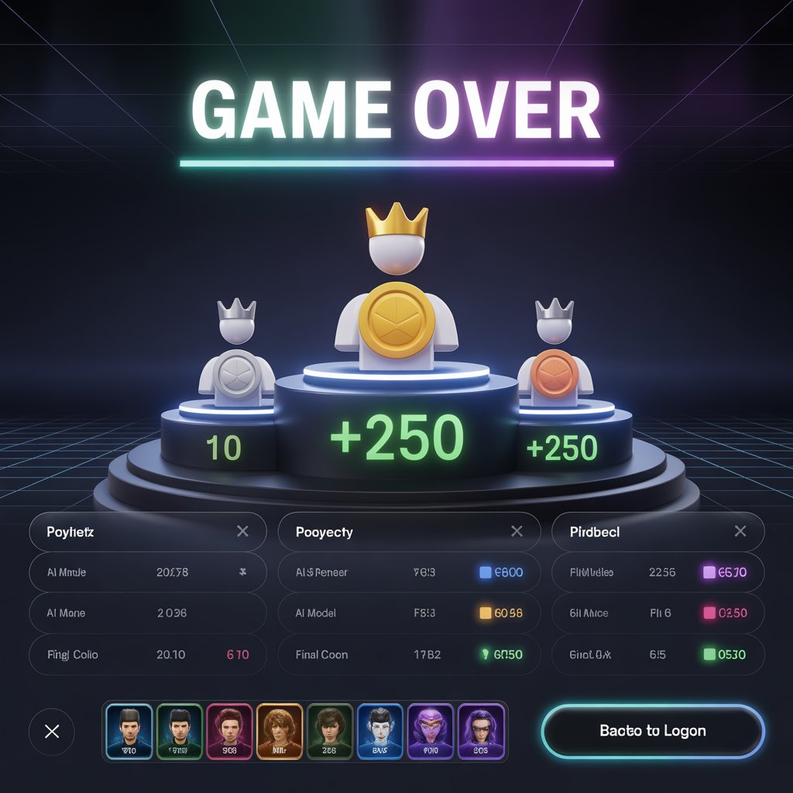

# LLM Golden Flower

A web-based **Zha Jin Hua (炸金花 / Three-Card Poker)** game where you play against up to 5 AI opponents, each powered by a different LLM. Every AI has its own personality, talks trash at the table, learns from past rounds, and keeps a detailed "thought journal" you can read after each game.

<p align="center">
  
  
</p>
<p align="center">
  
  
</p>

## Features

**Multi-Model AI Opponents** — Pit 1-5 AI players against you, each driven by a different LLM provider (OpenRouter, GitHub Copilot, Azure OpenAI, SiliconFlow). Mix and match models at the table.

**Distinct Personalities** — Five personality archetypes (Aggressive, Conservative, Analytical, Intuitive, Bluffer) that shape how each AI bets, bluffs, and talks.

**Table Talk & Bystander Chat** — AI trash-talks, bluffs verbally, reacts to other players' moves as a bystander, and responds to your typed messages — all in character. Chat context feeds back into AI decision-making.

**Experience Learning** — AI reviews its own play history and adjusts strategy when triggered by losing streaks, big losses, chip crises, opponent behavior shifts, or periodic review intervals.

**Thought Journal** — Every AI decision is recorded as a structured thought (hand evaluation, opponent analysis, risk assessment, reasoning, confidence, emotion). At the end of each round, a first-person narrative is generated. At game end, a full summary report covers stats, key moments, opponent impressions, and self-reflection.

**Cyberpunk Visual Theme** — Neon glow effects, glassmorphism panels, gradient borders, 3D poker table, and full-body cyberpunk character illustrations for each AI opponent.

## Game Rules (炸金花)

- Standard 52-card deck, 3 cards per player
- Hand rankings (high to low):
  - **豹子** Three of a Kind
  - **同花顺** Straight Flush
  - **同花** Flush
  - **顺子** Straight
  - **对子** Pair
  - **散牌** High Card
- Blind/seen betting: unseen players bet at half the rate of seen players
- Actions: Fold, Call, Raise, Check Cards (peek), Compare Hands
- Round ends when only one player remains, a compare is won, or max turns reached

## Tech Stack

| Layer | Technology |
|-------|------------|
| Frontend | React 19, TypeScript 5.9, Vite 7, React Router 7 |
| Styling | Tailwind CSS 4, Framer Motion 12, Lucide Icons |
| State | Zustand 5 |
| Backend | Python 3.9+, FastAPI, Uvicorn |
| AI Integration | LiteLLM (unified multi-provider API) |
| Database | SQLite, SQLAlchemy (async), aiosqlite |
| Communication | WebSocket (real-time) + REST API |

### Supported LLM Providers

| Provider | Auth Method | Notes |
|----------|-------------|-------|
| **OpenRouter** | API Key | Broadest model selection; search and add models dynamically |
| **GitHub Copilot** | OAuth Device Flow | Uses GPT-4o, GPT-4o Mini, Claude Sonnet via Copilot API |
| **Azure OpenAI** | API Key + Endpoint | List deployments by resource; configurable api_version |
| **SiliconFlow** | API Key | China-friendly; configurable api_host |

## Getting Started

### Prerequisites

- Python 3.9+
- Node.js 18+
- At least one LLM provider API key (or a GitHub Copilot subscription)

### Backend

```bash
cd backend
pip install -e ".[dev]"
uvicorn app.main:app --reload
```

The backend starts at `http://localhost:8000`. SQLite database is auto-created on first run.

### Frontend

```bash
cd frontend
npm install
npm run dev
```

The frontend starts at `http://localhost:5173` (Vite default).

### Configuration

All API keys are managed through the in-app **Model Config Panel** — no `.env` files needed. Keys are stored in memory only and never persisted to disk. Copilot auth uses the standard GitHub Device Flow (browser-based login).

## Project Structure

```
llm-golden-flower/
├── backend/
│   ├── app/
│   │   ├── main.py                 # FastAPI entry, CORS, lifespan
│   │   ├── config.py               # Settings, model registries, personality presets
│   │   ├── models/                 # Pydantic data models
│   │   │   ├── card.py             #   Card, Suit, Rank
│   │   │   ├── game.py             #   GameState, Player, GameAction, HandType
│   │   │   ├── chat.py             #   ChatMessage, ChatContext, BystanderReaction
│   │   │   └── thought.py          #   ThoughtRecord, RoundNarrative, GameSummary
│   │   ├── engine/                 # Core game logic
│   │   │   ├── deck.py             #   Shuffle & deal
│   │   │   ├── evaluator.py        #   Hand evaluation & comparison
│   │   │   ├── rules.py            #   Betting rules, action validation
│   │   │   └── game_manager.py     #   Full game lifecycle management
│   │   ├── agents/                 # AI player system
│   │   │   ├── base_agent.py       #   LLM calls, decision pipeline, JSON parsing
│   │   │   ├── agent_manager.py    #   Agent pool management
│   │   │   ├── personalities.py    #   5 personality archetypes
│   │   │   ├── prompts.py          #   6 prompt templates
│   │   │   ├── chat_engine.py      #   11 trigger types, bystander reactions
│   │   │   └── experience.py       #   5 review triggers, strategy adjustment
│   │   ├── thought/                # Thought journal system
│   │   │   ├── recorder.py         #   Decision → ThoughtRecord
│   │   │   └── reporter.py         #   LLM-generated narratives & summaries
│   │   ├── services/               # External service integrations
│   │   │   ├── provider_manager.py #   API key management, provider verification
│   │   │   └── copilot_auth.py     #   GitHub OAuth Device Flow, Copilot API
│   │   ├── api/                    # REST + WebSocket endpoints
│   │   │   ├── game.py             #   Game CRUD
│   │   │   ├── websocket.py        #   Real-time game events (11 event types)
│   │   │   ├── thought.py          #   Thought record queries
│   │   │   ├── chat.py             #   Chat history queries
│   │   │   ├── provider.py         #   Provider key management
│   │   │   ├── copilot.py          #   Copilot Device Flow endpoints
│   │   │   ├── openrouter.py       #   OpenRouter model management
│   │   │   ├── siliconflow.py      #   SiliconFlow model management
│   │   │   ├── azure_openai.py     #   Azure OpenAI model management
│   │   │   ├── settings.py         #   Runtime settings (max_tokens)
│   │   │   ├── persistence.py      #   DB write helpers
│   │   │   └── game_store.py       #   In-memory game state store
│   │   └── db/
│   │       ├── database.py         #   Async SQLAlchemy engine & sessions
│   │       └── schemas.py          #   8 ORM tables
│   └── tests/                      # 16 test files covering all modules
├── frontend/
│   └── src/
│       ├── main.tsx                # App entry
│       ├── App.tsx                 # Router setup (4 routes)
│       ├── types/game.ts           # TypeScript type definitions
│       ├── services/api.ts         # REST API client
│       ├── stores/                 # Zustand state management
│       │   ├── gameStore.ts        #   Game state, player actions
│       │   ├── uiStore.ts          #   UI state (modals, drawers, tabs)
│       │   └── settingsStore.ts    #   Runtime settings
│       ├── hooks/
│       │   ├── useWebSocket.ts     #   WebSocket connection & events
│       │   └── useGame.ts          #   Game flow orchestration
│       ├── pages/                  # Route pages
│       │   ├── WelcomePage.tsx     #   Landing page
│       │   ├── LobbyPage.tsx       #   Game setup & model config
│       │   ├── GamePage.tsx        #   Main game table
│       │   └── ResultPage.tsx      #   Post-game summary & reports
│       └── components/
│           ├── Lobby/              # Model config, game setup, Copilot connect
│           ├── Table/              # Table layout, pot, animations, chat
│           ├── Cards/              # Card face rendering
│           ├── Player/             # Player seat, chat bubbles
│           ├── Actions/            # Action panel, compare selector
│           ├── Thought/            # Thought drawer, timeline, narrative
│           └── Settlement/         # Leaderboard, AI summary cards
├── docs/
│   ├── PRD.md                      # Product requirements
│   ├── TECH_DESIGN.md              # Technical architecture
│   ├── TASKS.md                    # Task breakdown (30 tasks, 8 phases)
│   ├── design-system.md            # Cyberpunk design tokens
│   ├── redesign-plan.md            # UI redesign plan
│   └── design-refs/                # Visual design references
└── README.md
```

## Architecture Overview

```
┌─────────────────────────────┐
│   Browser (React SPA)       │
│                             │
│  Zustand Store ← Hooks      │
│       ↕                     │
│  WebSocket    REST Client   │
└─────┬──────────┬────────────┘
      │ ws://    │ http://
┌─────▼──────────▼────────────┐
│   FastAPI Backend            │
│                              │
│  ┌──────────┐ ┌───────────┐ │
│  │  Game     │ │ AI Agent  │ │
│  │  Engine   │ │ Manager   │ │
│  │ (rules,  │ │ (decision,│ │     ┌──────────────┐
│  │ evaluator,│ │  chat,    │ ├────►│  LLM APIs    │
│  │ manager) │ │  learning)│ │     │ (OpenRouter,  │
│  └──────────┘ └───────────┘ │     │  Copilot,     │
│  ┌──────────┐ ┌───────────┐ │     │  Azure, etc.) │
│  │ Thought  │ │ Provider  │ │     └──────────────┘
│  │ Journal  │ │ Manager   │ │
│  └──────────┘ └───────────┘ │
│         ↕                    │
│  ┌──────────────────┐       │
│  │ SQLite (async)   │       │
│  │ 8 tables         │       │
│  └──────────────────┘       │
└──────────────────────────────┘
```

**Information Hiding**: The frontend never receives other players' hand cards. Cards are only revealed during compare actions or end-of-round showdowns. AI agents can only see their own hand.

**Fault Tolerance**: Non-JSON LLM responses trigger a multi-layer text extraction fallback. Illegal AI actions degrade to the safest legal action (call or fold). API timeouts trigger auto-fold after 3 retries.

## WebSocket Events

| Direction | Event | Description |
|-----------|-------|-------------|
| Server → Client | `game_started` | Game created with player info |
| | `round_started` | New round begins |
| | `cards_dealt` | Cards dealt to players |
| | `turn_changed` | Active player changed |
| | `player_acted` | A player took an action |
| | `chat_message` | AI table talk or bystander reaction |
| | `round_ended` | Round results with card reveals |
| | `game_ended` | Final standings and summaries |
| | `ai_thinking` | AI is making a decision |
| | `ai_reviewing` | AI is reviewing experience |
| | `error` | Error notification |
| Client → Server | `player_action` | Human player action |
| | `chat_message` | Human player chat |
| | `start_round` | Request to start next round |

## Development Status

**83% complete** — 25 of 30 tasks done across 8 phases.

| Phase | Description | Status |
|-------|-------------|--------|
| Phase 1 | Game Engine (deck, evaluator, rules, manager) | Done |
| Phase 2 | AI Agent (decision, chat, personalities, prompts) | Done |
| Phase 3 | Experience Learning (review triggers, strategy adjustment) | Done |
| Phase 4 | Backend API (REST, WebSocket, persistence) | Done |
| Phase 5 | Frontend Basics (pages, components, stores) | Done |
| Phase 6 | Frontend Interaction (game flow, chat, animations) | Done |
| Phase 7 | Thought Journey Frontend (drawer, timeline, narratives) | Done |
| Phase 8 | Polish & Integration | In Progress |

### Remaining Work (Phase 8)

- Model Config Center + GitHub Copilot integration (partially done)
- End-to-end integration testing
- AI personality tuning & chat quality
- UI/UX polish (responsive layout, transitions)
- Error handling & robustness (reconnection, state recovery)

## Documentation

- [PRD](docs/PRD.md) — Product requirements, game rules, feature specs, user flows
- [Technical Design](docs/TECH_DESIGN.md) — Architecture, data models, AI agent design, API specs, DB schema
- [Task Breakdown](docs/TASKS.md) — 30 tasks across 8 phases with dependency tracking
- [Design System](docs/design-system.md) — Cyberpunk theme tokens, colors, typography, effects
- [Redesign Plan](docs/redesign-plan.md) — UI overhaul from casino green to cyberpunk neon

## License

Private project.
