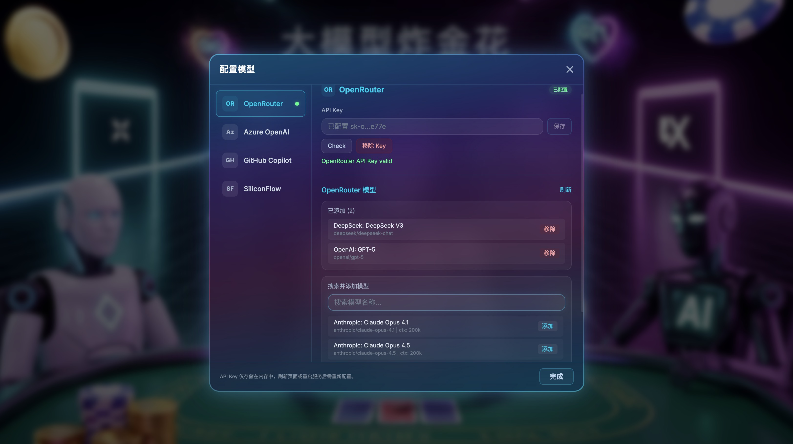
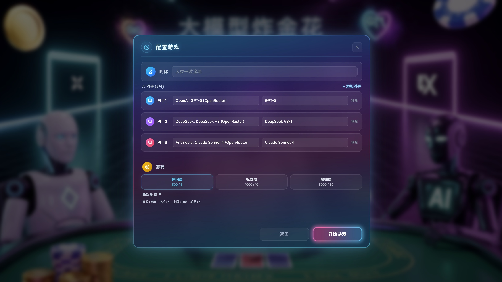
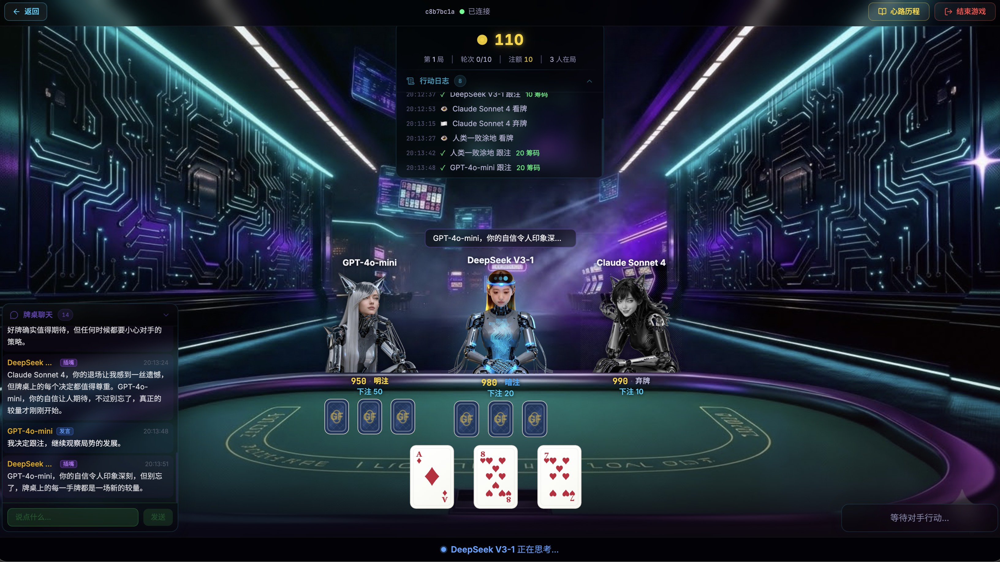
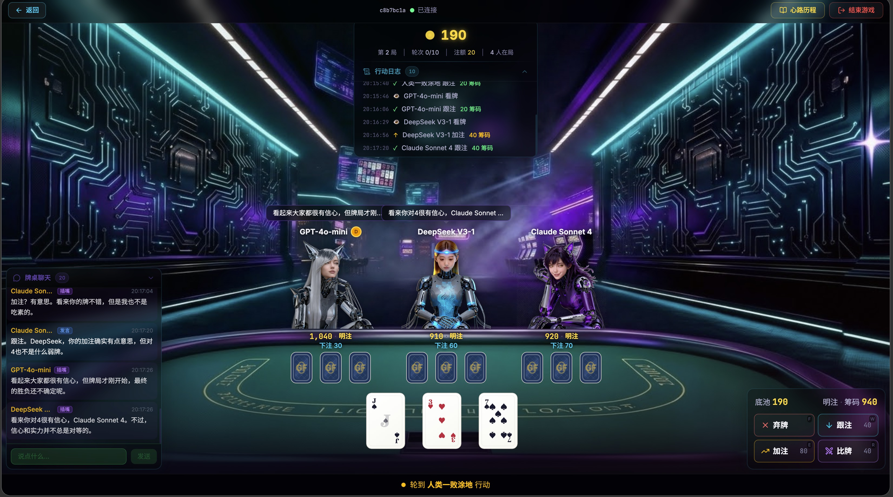

# LLM Golden Flower (大模型炸金花)

A web-based **Zha Jin Hua (炸金花 / Three-Card Poker)** game where you play against up to 5 AI opponents, each powered by a different LLM. Every AI decides its own play style and personality, trash-talks at the table, learns from past rounds, and keeps a detailed "thought journal" you can read after each game.

## Screenshots

### Model Configuration — Multi-Provider Support

Configure API keys and select models from OpenRouter, Azure OpenAI, GitHub Copilot, and SiliconFlow, all managed in-app.



### Game Setup — Choose Your Opponents

Pick 1–5 AI opponents with different LLM models, customize names, and set chip/ante levels.



### Game Table — AI Thinking & Table Talk

Watch AI opponents think, bet, and trash-talk each other in real-time. The chat panel shows bystander reactions and action commentary.



### Game Table — Your Turn to Act

When it's your turn, choose from fold, call, raise, or compare. AI opponents react to your every move.



## Features

- **Multi-Model AI Opponents** — 1–5 AI players, each driven by a different LLM provider (OpenRouter, GitHub Copilot, Azure OpenAI, SiliconFlow). Mix and match models at the table.
- **LLM-Driven Strategy** — No preset personalities or hard-coded rules. Each AI's play style, bluffing tendency, and risk tolerance emerge entirely from the LLM's own reasoning. Their only instruction: "your goal is to win."
- **Table Talk** — AI trash-talks, reacts to other players' moves, and responds to your messages. Every bystander AI calls the LLM to decide whether to chime in — no probability gating, fully LLM-decided.
- **Experience Learning** — AI reviews its own play and adjusts strategy on losing streaks, big losses, chip crises, or opponent shifts.
- **Thought Journal** — Structured decision records (hand eval, risk, confidence, emotion) + first-person narratives per round + full game summary with stats and self-reflection.
- **Cyberpunk Theme** — Neon glow, glassmorphism, 3D poker table, full-body character illustrations.

## Game Rules (炸金花)

Standard 52-card deck, 3 cards per player. Hand rankings (high to low):

**豹子** Three of a Kind > **同花顺** Straight Flush > **同花** Flush > **顺子** Straight > **对子** Pair > **散牌** High Card

Unseen players bet at half rate. Actions: Fold, Call, Raise, Peek, Compare.

## Tech Stack

| Layer | Technology |
|-------|------------|
| Frontend | React 19, TypeScript, Vite 7, Tailwind CSS 4, Framer Motion, Zustand |
| Backend | Python, FastAPI, LiteLLM, SQLAlchemy (async), SQLite |
| Communication | WebSocket + REST |

### LLM Providers

OpenRouter, GitHub Copilot (OAuth Device Flow), Azure OpenAI, SiliconFlow — all configurable in-app.

## Getting Started

### Backend

```bash
cd backend
pip install -e ".[dev]"
uvicorn app.main:app --reload
# → http://localhost:8000
```

### Frontend

```bash
cd frontend
npm install
npm run dev
# → http://localhost:5173
```

API keys are managed in the in-app Model Config Panel — no `.env` needed. Keys are memory-only, never persisted to disk.

## Architecture

```
Browser (React SPA)
  ↕ WebSocket + REST
FastAPI Backend
  ├── Game Engine — deck, evaluator, rules, game lifecycle
  ├── AI Agents — LLM decision, chat, experience learning
  ├── Thought Journal — structured records, narratives, summaries
  └── SQLite — 8 tables (async)
  ↕ LLM APIs (OpenRouter, Copilot, Azure, SiliconFlow)
```

**Information hiding**: frontend never sees other players' cards. **Fault tolerance**: non-JSON LLM responses trigger multi-layer fallback; illegal actions degrade to call/fold; API timeouts auto-fold after retries.

## Documentation

- [PRD](docs/PRD.md) — Requirements, game rules, feature specs
- [Technical Design](docs/TECH_DESIGN.md) — Architecture, data models, API specs
- [Tasks](docs/TASKS.md) — 30 tasks across 8 phases

## License

[MIT](LICENSE)
